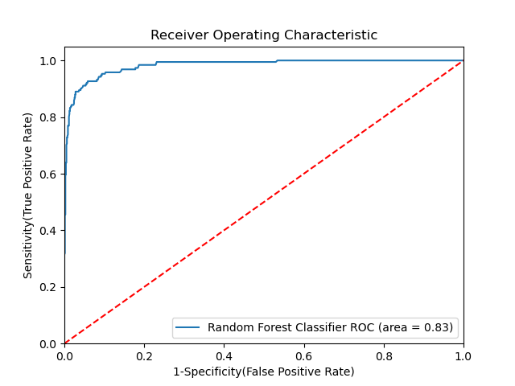

# 🌲 Random Forest — Classification & Regression

A two-project repository demonstrating end-to-end machine learning pipelines using **Random Forest** for both classification and regression tasks. Each project covers real-world datasets, data cleaning, EDA, feature engineering, model benchmarking, and hyperparameter tuning.

---

## 📁 Repository Structure

```
├── Random_Forest_Classification_Implementation.ipynb   # Holiday package purchase prediction
├── Random_Forest_Regression_Implementation.ipynb       # Used car price prediction
├── Travel.csv                                          # Classification dataset
├── cardekho_imputated.csv                              # Regression dataset
├── auc.png                                             # ROC-AUC curve
└── README.md
```

---

## 📌 Project 1 — Holiday Package Purchase Prediction (Classification)

### Problem Statement

**Trips & Travel.Com** wants to expand its customer base by launching a new **Wellness Tourism Package**. In the past, only 18% of customers purchased packages, but marketing was inefficient because customers were contacted randomly.

The goal is to **predict whether a customer will purchase the new package** using historical data — so the company can target the right customers and reduce marketing costs.

### Dataset

- **Source:** [Kaggle — Holiday Package Purchase Prediction](https://www.kaggle.com/datasets/susant4learning/holiday-package-purchase-prediction)
- **Rows:** 4,888 | **Columns:** 20
- **Target:** `ProdTaken` — 1 (Purchased) / 0 (Not Purchased)
- **Class Distribution:** 3,968 (Not Taken) vs 920 (Taken) — imbalanced dataset

| Feature | Description |
|---------|-------------|
| Age | Customer age |
| TypeofContact | Self Enquiry / Company Invited |
| CityTier | City tier (1, 2, 3) |
| DurationOfPitch | Duration of sales pitch (minutes) |
| Occupation | Salaried / Free Lancer / Small Business / Large Business |
| Gender | Male / Female |
| NumberOfFollowups | Follow-up calls made |
| ProductPitched | Package type pitched (Basic / Standard / Deluxe / Super Deluxe / King) |
| PreferredPropertyStar | Preferred hotel star rating |
| MaritalStatus | Married / Unmarried / Divorced |
| NumberOfTrips | Avg trips per year |
| Passport | Owns passport (1/0) |
| PitchSatisfactionScore | Satisfaction score of pitch (1–5) |
| OwnCar | Owns car (1/0) |
| Designation | Job designation |
| MonthlyIncome | Monthly income (₹) |

### Data Cleaning & Feature Engineering

- Fixed inconsistent labels: `"Fe Male"` → `"Female"`, `"Single"` → `"Unmarried"`
- Imputed missing values:
  - Median: `Age`, `DurationOfPitch`, `NumberOfTrips`, `MonthlyIncome`
  - Mode: `TypeofContact`, `NumberOfFollowups`, `PreferredPropertyStar`, `NumberOfChildrenVisiting`
- Created new feature: `TotalVisiting` = `NumberOfPersonVisiting` + `NumberOfChildrenVisiting`
- Applied **OneHotEncoding** for categorical features and **StandardScaler** for numerical features via `ColumnTransformer`

### Model Benchmarking Results

| Model | Train Accuracy | Test Accuracy | Test Precision | Test Recall | Test ROC-AUC |
|-------|---------------|---------------|----------------|-------------|--------------|
| Logistic Regression | 84.60% | 83.64% | 69.14% | 29.32% | 0.6307 |
| Decision Tree | 100.00% | 91.72% | 80.56% | 75.92% | 0.8573 |
| **Random Forest** | **100.00%** | **93.15%** | **97.69%** | **66.49%** | **0.8398** |
| Gradient Boosting | — | — | — | — | — |

### Hyperparameter Tuning (RandomizedSearchCV — 3-fold CV, 100 iterations)

Best parameters found for Random Forest:

```
n_estimators      : 1000
min_samples_split : 2
max_features      : 8
max_depth         : None
```

### Final Tuned Model Performance

| Set | Accuracy | F1 Score | Precision | Recall | ROC-AUC |
|-----|----------|----------|-----------|--------|---------|
| Train | 100.00% | 1.0000 | 100.00% | 100.00% | 1.0000 |
| **Test** | **93.35%** | **0.9291** | **96.32%** | **68.59%** | **0.8398** |

### ROC-AUC Curve



> The ROC curve shows strong discriminative ability with an AUC of **0.83**, meaning the model correctly distinguishes purchasers from non-purchasers 83% of the time. The steep initial rise confirms the model captures true positives at very low false positive rates — ideal for targeted marketing campaigns.

---

## 📌 Project 2 — Used Car Price Prediction (Regression)

### Problem Statement

Predict the **selling price of used cars** listed on [CarDekho.com](https://www.cardekho.com) based on vehicle attributes. Results can be used to give sellers a market-aligned price suggestion at time of listing.

### Dataset

- **Source:** Scraped from CarDekho.com
- **Rows:** 15,411 | **Columns:** 13
- **Target:** `selling_price` (in ₹)
- **No missing values** (pre-imputed dataset)

| Feature | Description |
|---------|-------------|
| model | Car model name (120 unique values) |
| vehicle_age | Age of the vehicle (years) |
| km_driven | Total kilometres driven |
| seller_type | Individual / Dealer / Trustmark Dealer |
| fuel_type | Petrol / Diesel / CNG / LPG / Electric |
| transmission_type | Manual / Automatic |
| mileage | Fuel efficiency (km/l) |
| engine | Engine displacement (cc) |
| max_power | Maximum power (bhp) |
| seats | Number of seats |

### Data Cleaning & Feature Engineering

- Dropped `car_name` and `brand` (redundant with `model`)
- Applied **LabelEncoding** on `model` (120 unique values — too high cardinality for OHE)
- Applied **OneHotEncoding** on `seller_type`, `fuel_type`, `transmission_type`
- Applied **StandardScaler** on all numerical features via `ColumnTransformer`

### Model Benchmarking Results

| Model | Train RMSE | Test RMSE | Train MAE | Test MAE | Train R² | Test R² |
|-------|-----------|----------|----------|---------|---------|--------|
| Linear Regression | 5,53,855 | 5,02,543 | 2,68,101 | 2,79,618 | 0.6218 | 0.6645 |
| Lasso | 5,53,855 | 5,02,542 | 2,68,099 | 2,79,614 | 0.6218 | 0.6645 |
| Ridge | 5,53,856 | 5,02,533 | 2,68,059 | 2,79,557 | 0.6218 | 0.6645 |
| KNN (default) | 3,25,873 | 2,53,024 | 91,425 | 1,12,526 | 0.8691 | 0.9150 |
| Decision Tree | 20,797 | 3,07,402 | 5,164 | 1,25,825 | 0.9995 | 0.8745 |
| **Random Forest** | **1,39,404** | **2,30,109** | **39,945** | **1,01,816** | **0.9760** | **0.9297** |

> Linear, Lasso, and Ridge all plateaued at R² ≈ 0.66, confirming that car pricing involves non-linear relationships not captured by linear models. Decision Tree severely overfits (Train R² = 0.9995 vs Test R² = 0.8745), while Random Forest strikes the best balance between fit and generalisation.

### Hyperparameter Tuning (RandomizedSearchCV — 3-fold CV, 100 iterations)

Best parameters found:

```
Random Forest:
  n_estimators      : 100
  min_samples_split : 2
  max_features      : auto
  max_depth         : None

KNN:
  n_neighbors : 10
```

### Final Tuned Model Performance

| Model | Train RMSE | Test RMSE | Train MAE | Test MAE | Train R² | Test R² |
|-------|-----------|----------|----------|---------|---------|--------|
| **Random Forest** | **1,29,998** | **2,28,415** | **39,738** | **1,02,398** | **0.9792** | **0.9307** |
| KNN (k=10) | 3,63,464 | 2,63,872 | 1,03,451 | 1,17,483 | 0.8371 | 0.9075 |

> Random Forest explains **93% of variance** in used car selling prices on the test set — a significant jump from the 66% achieved by linear models. Average prediction error of ₹1,02,398 is reasonable given the wide price range in the Indian used car market.

---

## 🛠️ Tech Stack

- **Language:** Python 3
- **Libraries:** Pandas, NumPy, Matplotlib, Seaborn, Plotly, Scikit-learn
- **Environment:** Jupyter Notebook

---

## ▶️ How to Run

1. Clone the repository:
   ```bash
   git clone https://github.com/your-username/random-forest-projects.git
   cd random-forest-projects
   ```

2. Install dependencies:
   ```bash
   pip install pandas numpy matplotlib seaborn plotly scikit-learn jupyter
   ```

3. Run Classification project:
   ```bash
   jupyter notebook Random_Forest_Classification_Implementation.ipynb
   ```

4. Run Regression project:
   ```bash
   jupyter notebook Random_Forest_Regression_Implementation.ipynb
   ```

---

## 📈 Key Insights

**Classification — Holiday Package Purchase**
- Random Forest achieved **93.35% accuracy** with a very high precision of **96.32%** — when the model predicts a customer will buy, it is almost always right. Critical for minimising wasted marketing spend.
- Recall of 68.59% means some actual buyers are missed. This is an acceptable trade-off in a marketing context where precision matters more than recall.
- The dataset's class imbalance (81% non-purchasers) makes ROC-AUC a more reliable metric than raw accuracy.

**Regression — Used Car Pricing**
- Linear models plateaued at R² ≈ 0.66, confirming non-linear interactions between engine power, vehicle age, km driven, and fuel type drive pricing.
- After tuning, Random Forest achieved **R² = 0.93** with test MAE of ₹1,02,398 — strong performance for a market with prices spanning ₹20,000 to several crores.
- `max_power`, `engine` displacement, and `vehicle_age` are expected to be the dominant price drivers based on domain knowledge.

---

## 👤 Author

**Vedant Ingle**  
M.A. Economics | Data & ML Enthusiast  
[LinkedIn](https://www.linkedin.com/in/your-profile) · [GitHub](https://github.com/your-username)
